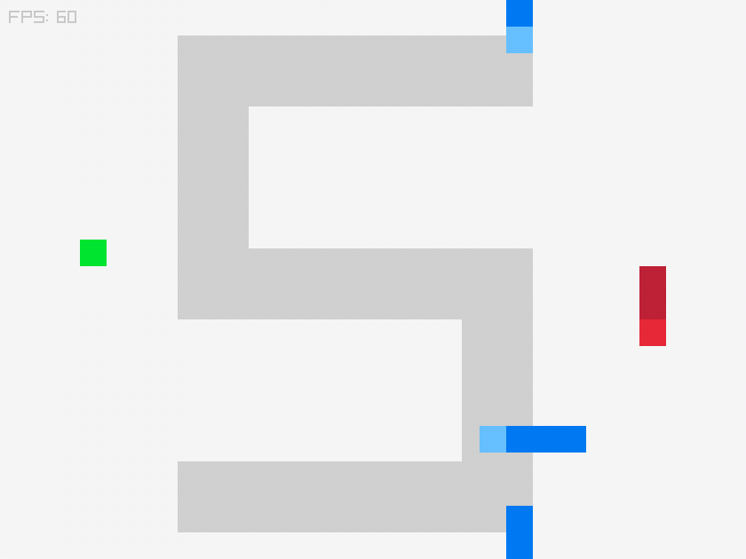

# Snake Variations

25 variations and theme based on Snake. 

Play online here: https://kallehed.github.io/Snake-Variations/

## Development:

When cloning, make sure to use the flag `--recurse-submodules` to download the raylib source code as well. Otherwise it won't compile.

Also, if you add a new file to ./src, you will have to resave the CMakeLists.txt to make it notice.

### Build for Linux Desktop:
first:
`mkdir relbuild && cd relbuild && cmake .. -DCMAKE_BUILD_TYPE=Release`
and then to run:
`make -j6 && ./my_project`

### Build for Windows:

Building on windows is as simple as opening the project with Visual Studio, and having the CMake build tools installed (mine were there by default), and building with your preferred options.

### Build for the Web:
first:
`mkdir webbuild && cd webbuild && emcmake cmake .. -DCMAKE_BUILD_TYPE=Release -DPLATFORM=Web`
then:
`cmake --build .`
To test it, you can do:
`python -m http.server`
And then surf into localhost:8000 and choose the html file.

